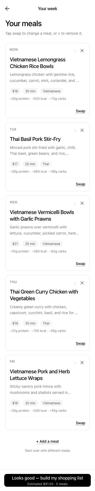
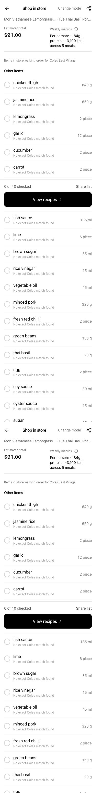
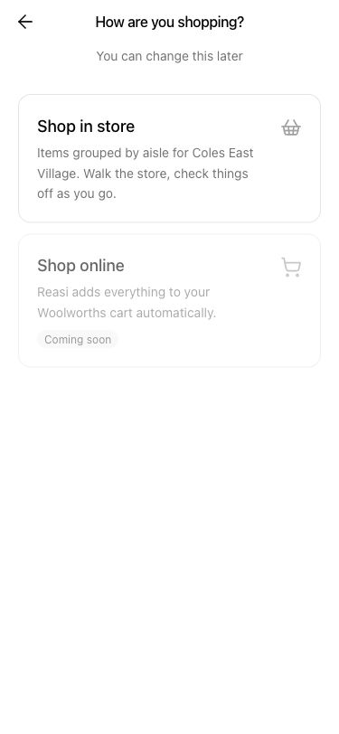
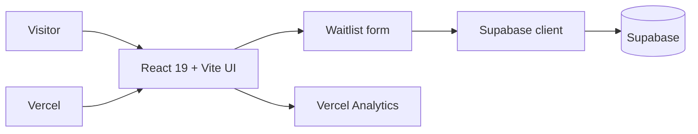

# Reasi AI

Reasi AI is a product and waitlist experience for an AI grocery-planning agent. The product concept turns household preferences into weekly meals, consolidated shopping lists, budget-aware swaps, and a checkout plan that remains under human control.

[Live demo](https://reasi-ai.vercel.app)

## Product preview

| Meal planning | Shopping list | Shopping mode |
| --- | --- | --- |
|  |  |  |

## Current scope

This repository contains the public product and waitlist experience used to communicate the concept and validate demand. It is not yet the grocery-agent backend.

Implemented features include:

- Responsive React product site with animated sections and app-preview screens
- Supabase-backed waitlist form with duplicate-email handling
- Supermarket and suburb context captured with waitlist submissions
- Vercel Analytics integration and Vercel deployment configuration
- Mobile-first flow covering plan, swap, list, shop, and cook

## Architecture



The browser uses the public Supabase client configuration supplied through Vite environment variables. Database policies remain the security boundary for waitlist writes.

## Tech stack

- React 19 and Vite 7
- Supabase
- Framer Motion and Lucide React
- Vercel Analytics
- CSS

## Run locally

```bash
git clone https://github.com/tuilachit/reasi_ai.git
cd reasi_ai/waitlist
npm install
cp .env.example .env.local
npm run dev
```

Set the following values in `.env.local`:

```bash
VITE_SUPABASE_URL=your-supabase-url
VITE_SUPABASE_ANON_KEY=your-supabase-anon-key
```

The visual site still renders without these values, but waitlist submissions will not persist.

## Validate a production build

```bash
cd waitlist
npm run lint
npm run build
```

## Repository layout

```text
.
├── vercel.json
└── waitlist/
    ├── public/
    │   ├── logos/
    │   └── reasi-app/
    ├── src/
    │   ├── lib/supabaseClient.js
    │   ├── App.jsx
    │   ├── App.css
    │   ├── index.css
    │   └── main.jsx
    ├── .env.example
    ├── package.json
    └── vite.config.js
```

## Next engineering steps

- Add automated tests for validation, duplicate-email handling, and Supabase failure states
- Document the future grocery-agent backend and its human-approval boundary
- Add an accessible end-to-end waitlist test against a disposable Supabase project
